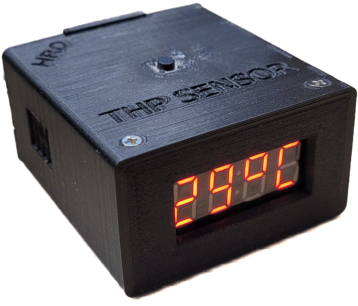
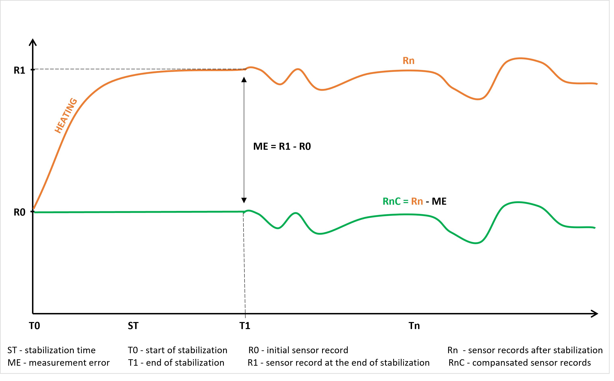
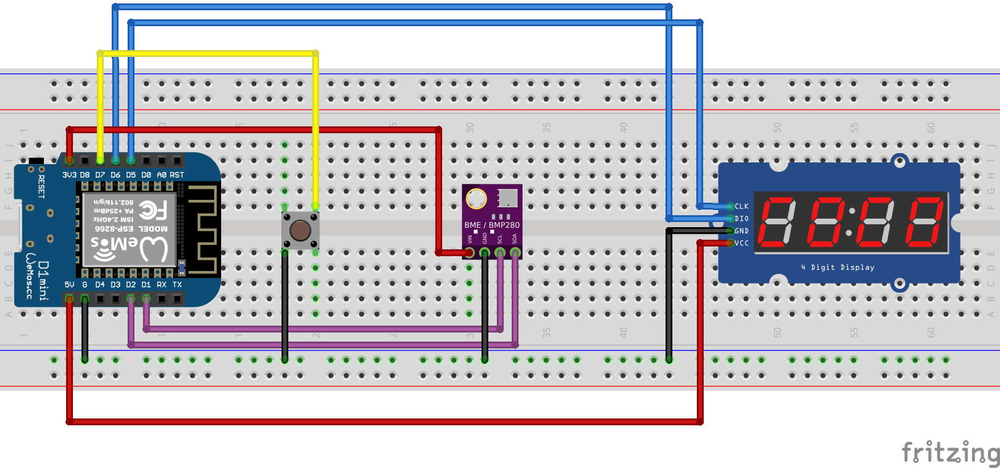
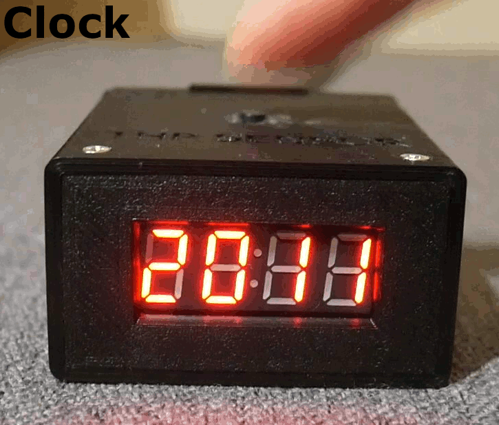

# THP SENSOR DEVICE


## 1. Description
Portable device that the main function is to measure temperature, humidity and pressure. Additionally device has an integrated network-synchronized clock (based on NTP servers). Hardware componenets were enclosed in a custom, 3D printed case. All information is displayed on a 4-digit LED screen and can be switched manually using a button.

<p align="center"></p>


## 2. Features
* measurement of temperature, humidity and pressure,
* network-synchronized clock (based on NTP servers) integrated with device,
* displaying information on a 4-digit 7-segment LED screen,
* switching displayed information using a button,
* portability because of pocket-size, 
* 5V power supply via micro USB cable.


## 3. Software
Program was written in the Arduino enviroment and installed on ESP8266-12F WiFi module that is placed on the WeMos D1 mini board. Below presented installation procedure and other important notes.

### 3.1 Installation procedure
1) Install [CH340 driver](https://www.wemos.cc/en/latest/ch340_driver.html) on your PC to provide proper  communication with the WeMos D1 mini board (not neccessary for Mac OSX 10.14 and greater).
2) Install [Arduino IDE](https://www.arduino.cc/en/software).
3) Open Arduino IDE and enter `http://arduino.esp8266.com/stable/package_esp8266com_index.json` in *File>Preferences>Settings>Additional board manager URLs* to support ESP8266 module.
4) Set correct board (*Tools>Board>esp8266>LOLIN(WEMOS) D1 mini (clone)* - in my case) and COM port (*Tools>Port>COM...* - select port to which the board is connected).
5) Download [THP_sensor.ino](https://github.com/HeroMar/THP_sensor_device/blob/master/THP_sensor.ino) and upload file to the board. IMPORTANT - to provide clock functionality insert your network details in code. Additionally if you not live in CEST time zone you may need to change TZ (Time Zone) and DST (Daylight Saving Time) information that will correspond to your local time - [more helpful info about setting time here](https://werner.rothschopf.net/202011_arduino_esp8266_ntp_en.htm).

    ```
    const char* ssid="..."; //name of WiFi network
    const char* password="...";//WiFi password

    const char* MY_TZ="CET-1CEST,M3.5.0/02,M10.5.0/03"; //TZ and DST set for CEST 
    ```

### 3.2 Heating issue - measurement errors
One of the main goal for this project was to design device that would be compact. For this reason it was difficult to separate THP sensor from the influence of heat generated by microcontroller unit. This obviously caused significant measurement errors that had to be compensated. [THP_sensor_comp.ino](https://github.com/HeroMar/THP_sensor_device/blob/master/THP_sensor_comp.ino) contain additional lines of code that handle this problem. It's not perfect solution and requires compromise which is explained below. **So if there is ability to place the sensor in separation of heating sources, i highly recommend to do that instead of bothering with compensation**.

To implement software compensation the key was to define time needed to stabilize THP sensor readings. With the help of [Serial Data Monitor](https://github.com/HeroMar/Serial_data_monitor) carried out analyse which allowed to determinate stabilization time ("ST") - in my case it was 1 hour. To carry out compensation, the measurement error ("ME") must be calculated. For that reason two sensor readings are recorded: first one right after run a device ("R0" - initial record without measurement error) and second one at the end of the stabilization time ("R1" with measurement error). By compering these two records it is possible to calculate value of measurement error ("ME") and take it into account for further sensor readings. Keep in mind that during stabilization ("ST") sensor readings are frozen and only fixed "R0" values are displayed on LED screen during this time. Below is schematic diagram that show idea of implemented compensation.

<p align="center"></p>


## 4. Hardware

### 4.1 List of components used in project
* Microcontroller: `WeMos D1 mini (ESP8266-12F)`
* THP sensor: `BME280`
* Display: `4-digit 7-segment LED display module with TM1637 driver`
* Button: `tact micro switch 6x6 mmm`

<p align="center"></p>

### 4.2 Connections

<div align="center">

| WeMos D1 mini | BME280        | LED display | Button |
| :-----------: |:-------------:| :----------:|:-----: |
| G             | GND           | GND         | "-"    |
| 3V3           | VIN           |             |        |
| 5V            |               | VCC         |        |
| D1            | SCL           |             |        |
| D2            | SDA           |             |        |
| D5            |               | CLK         |        |
| D6            |               | DIO         |        |
| D7            |               |             | "+"    |

</div>

</br>
<p align="center"></p>


## 5. Showcase

<p align="center"></p>